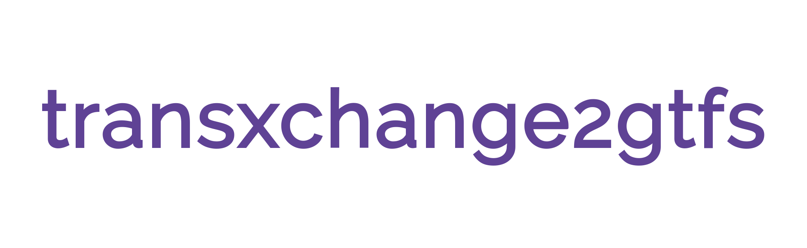

[](https://travis-ci.org/planarnetwork/transxchange2gtfs)  

transxchange2gtfs converts [TransXChange](http://naptan.dft.gov.uk/transxchange/index.htm) timetable data into a [GTFS](https://developers.google.com/transit/gtfs/) zip.

## Comparison

There are other [similar projects](https://github.com/search?q=transxchange+gtfs), each with their own merits. This tool has some features not found in the others:

- Smaller output - identical calendars are reused
- Better handling of bank holidays
- Built in NaPTAN data (stop names, longitude, latitude)
- Ability to process multiple files, including zips
- Low memory usage - most large files use less than 1GB, processing the entire UK data set requires 2GB
- Generates interchange time and transfers to nearby stops

## Installation

Please note that zip/unzip and [node 10.x](https://nodejs.org) or above are required.

transxchange2gtfs is a CLI tool that can be installed via NPM:

```
sudo apt-get install nodejs zip
npm install -g transxchange2gtfs
```

## Usage

It can be run by specifying the input and output files as CLI arguments:

```
transxchange2gtfs transxchange1.xml transxchange2.xml gtfs-output.zip
```

Or using zip files:

```
transxchange2gtfs multiple-transxchange-files.zip /path/*.zip single-transxchange.xml gtfs-output.zip
```

## Notes

- All stop times are left in the original timezones (assumed to be local time).
- It is assumed that any stops in different TransXChange documents with the same ATCO are the same stop.
- Stop data is derived from [NaPTAN](http://naptan.app.dft.gov.uk/datarequest/help).
- TransXChange is a [bizarre and over-engineered standard](http://naptan.dft.gov.uk/transxchange/training/EBSR/EBSR%20Training%20Toolkit%20v1.0/3%20Resources/Guides/TransXChange%20Schema%20Guide-2.1-v-44.pdf), there are probably edge cases that have not been covered.
- A MySQL for the GTFS files is provided in the resource folder, along with an import script.  

## Contributing

Issues and PRs are very welcome. To get the project set up run

```
git clone git@github.com:planarnetwork/transxchange2gtfs
npm install --dev
npm test
```

If you would like to send a pull request please write your contribution in TypeScript and if possible, add a test.

## License

This software is licensed under [GNU GPLv3](https://www.gnu.org/licenses/gpl-3.0.en.html).

